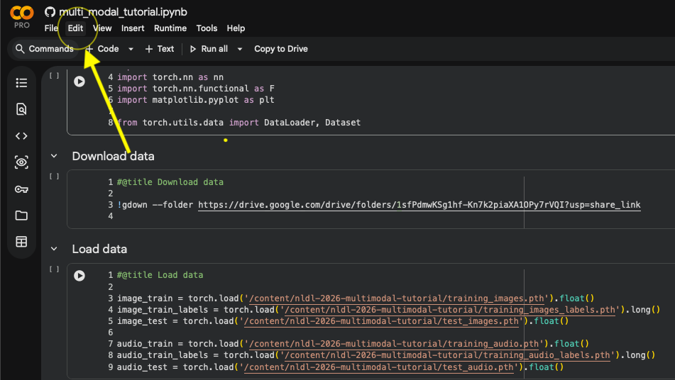
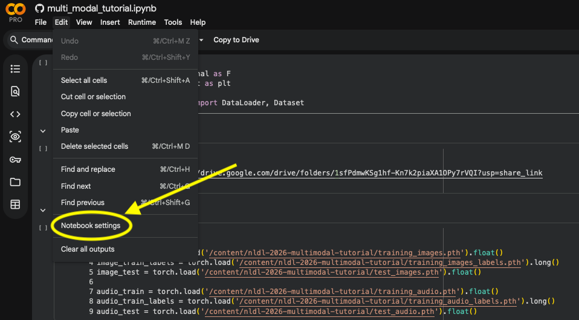
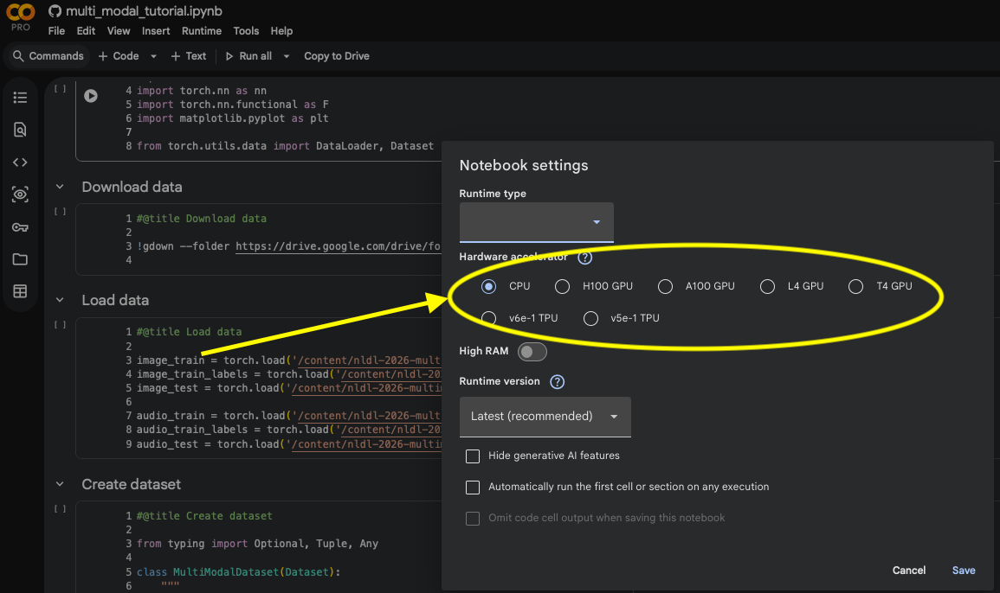
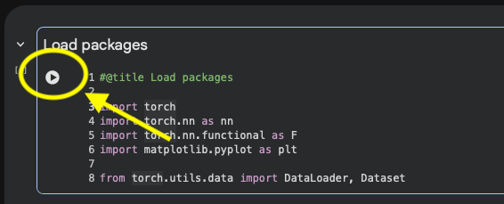
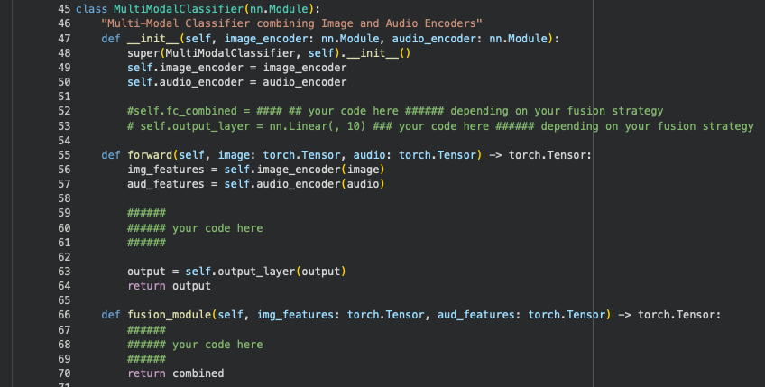
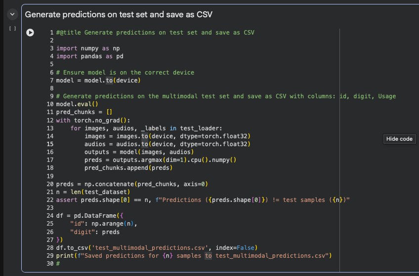
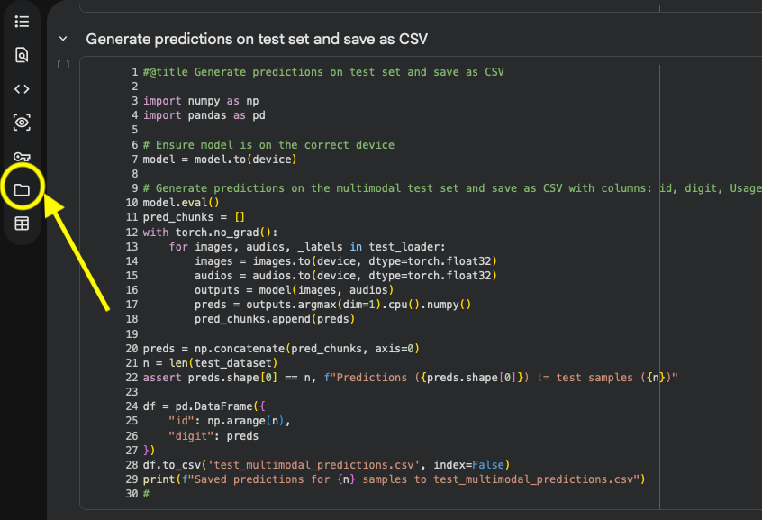
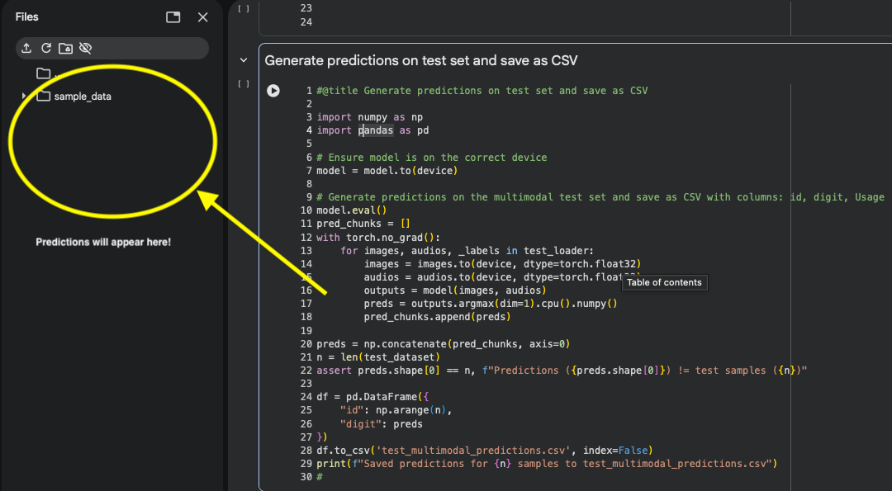

# Northern Lights Deep Learning Tutorial on Multimodal Learning

This repository contains notebooks and example code for a hands-on multimodal learning tutorial. Further down is an overview and a description of the task in the tuorial. What follows is a detailed descripton oof how to follow the tutorial and upload your results to the leaderboard of the tutorial.

## Tutorial Steps

### Step 1: Open the Notebook in Google Colab

---

### Step 2: Enable GPU support

- Click on "Edit" in the top menu: 
- Select "Change runtime type": 
- Select a GPU under "Hardware accelerator":

### Step 3: Run code and fill in missing fusion part

- Run code by clicking this symbol: 
- Must run all cells in order. 
- Fill in the missing code for fusing data:

### Step 4: Generate Predictions

- Generate predictions: 
- Predictions are stored here: 
- Prediction appear here: 
- Download predictions and upload here: 

## Description of task

You are working as a machine learning engineer in an international post sorting company, and your boss
has tasked you with solving a challenging problem. Customers often provide handwritten digits that
must be automatically classified as image data for efficiency, but the camera you have available frequently
fails and introduces a great deal of noise into the data. You come up with an idea to incorporate a
fail-safe into your system. In addition to writing the digits down, the customers will now also repeat
the digits into a microphone, thus creating both an audio and an image version of their desired digits.
Unfortunately, your available microphone is not of the best quality, and also frequently introduces noise in
the audio recordings. Nevertheless, you believe that processing both modalities at the same time will lead to
satisfactory performance.

To test your idea, you collect 17560 pairs of images and audio of digits with a corresponding label for
training. In addition, you also collect an independent set of 5859 pairs of images and audio of digits with a corresponding label to test your system.

##

The figure below shows pairs of samples from the provided dataset. For each sample, noise is added such that one modality is more noisy than the other, or both are slightly noisy. This means that there is al limit to how well the model can perform using only one modality. However, if both modalities are processed simultaneously, there should always be a clean view that has the necessary information to make a prediction.

